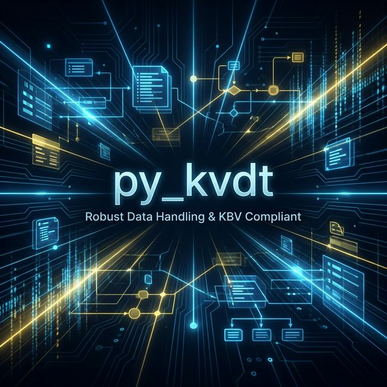
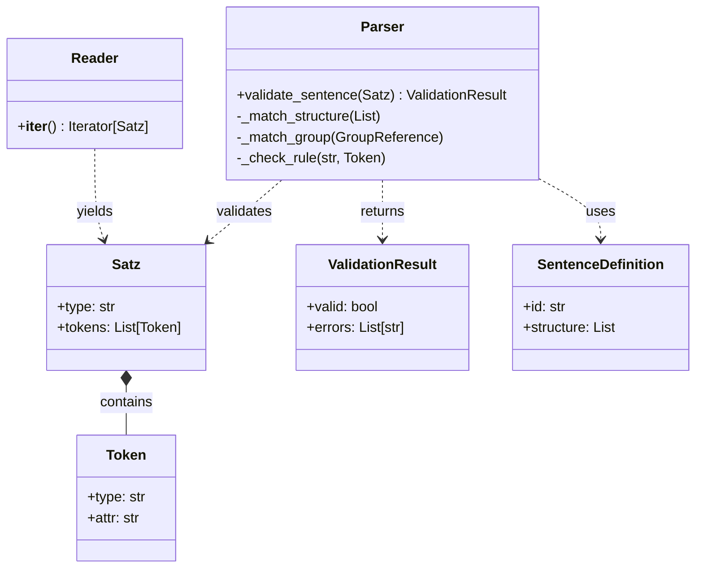
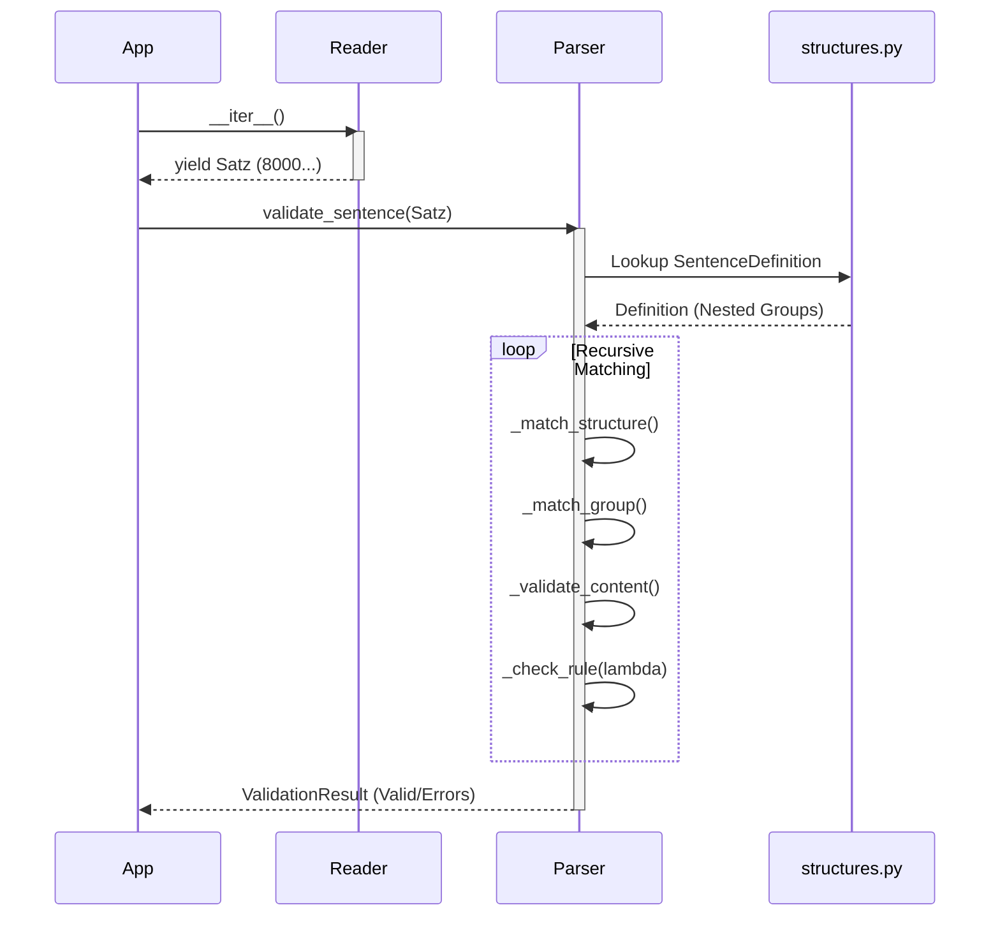

py_kvdt
=======




Python library for parsing and validating KVDT files (KBV Datentransfer).

## Features

- **Modern structure**: Clean package layout with type hints and dataclasses.
- **Full Standard Support**: Validates all KVDT field definitions and sentence structures (recursive).
- **Rule Engine**: Supports KVDT rule validation (including context-dependent checks).
- **No dependencies**: Uses standard library only.

## Installation

1. Clone the repository: `git clone https://github.com/maatini/py_kvdt.git`
2. Navigate to the directory: `cd py_kvdt`
3. Install (editable mode): `pip install -e .`

## Development with Devbox

This project uses [Devbox](https://www.jetpack.io/devbox/) to manage a consistent development environment.

### Prerequisites

- Install Devbox: `curl -fsSL https://get.jetpack.io/devbox | bash`

### Getting Started

1.  Enter the shell: `devbox shell`
2.  Initial setup (within shell): `devbox run setup`

### Available Scripts

You can run these scripts using `devbox run <script_name>`:

- `test`: Run unit tests (`python3 -m unittest discover tests`)
- `lint`: Run linting checks (`ruff check .`)
- `format`: Format code (`black .`)
- `setup`: Install the package in editable mode (`uv pip install -e .`)

## Usage

### CLI
Run the parser on a KVDT file:

```bash
python3 -m src.pykvdt <path_to_file>
```

### Library
```python
from src.pykvdt.reader import Reader
from src.pykvdt.parser import Parser

reader = Reader("path/to/file.con")
parser = Parser()

for satz in reader:
    result = parser.validate_sentence(satz)
    if not result.valid:
        print(result.errors)
```

## Legacy Code
The original 2014 implementation is available in the `legacy/` directory.


## Architecture & Approach

This project modernizes the parsing of KVDT files by strictly separating **Data** (Standard Definitions) from **Logic** (Parsing/Validation).

### 1. Table-Driven Parsing
The KVDT standard is inherently a collection of tables defining fields and sentence structures. Instead of hardcoding these rules into procedural code (e.g., `if field == '3000': ...`), this project defines them declaratively in `src/pykvdt/structures.py` and `src/pykvdt/definitions.py`.

**Advantages:**
- **Maintainability:** Updates to the standard (KBV updates) only require changes to the definition files, not the parser logic.
- **Readability:** The structure definitions map 1:1 to the official KBV specifications.
- **Decoupling:** The parser puts no constraints on the data structure, making it robust against changes.

### 2. Recursive Descent Parser
The `Parser` class (`src/pykvdt/parser.py`) implements a recursive descent algorithm that traverses the sentence definitions. It handles:
- **Nested Groups**: Supports arbitrary nesting of fields (e.g., `Leistungen` within `Satzart 0101`).
- **Repetition**: Handles fields and groups that can appear multiple times (`count` or `-1` for unlimited).
- **Rule Engine**: Evaluates context-dependent rules (e.g., "Field X is only allowed if Sentence is Y") using lambda expressions defined in the standard.

### 3. Type Safety & Modern Python
- **Dataclasses**: Used for all core models (`Token`, `Satz`, `ValidationResult`) to ensure data integrity.
- **Type Hints**: Fully typed codebase supporting modern IDEs and static analysis.
### 4. Validation Strategy
Validation occurs at three distinct levels to ensure data quality:
1.  **Field Level**: Checks format (Numeric, Alphanumeric, Date) and length constraints using regex and simple logic in `validators.py`.
2.  **Sentence Level**: The recursive parser validates the structure of a sentence (Order of fields, Missing mandatory fields/groups, Excess tokens).
3.  **Cross-Field Rules**: The `Parser` evaluates conditional rules (e.g., "Field A required if Field B is X") using the lambda expressions migrated from the standard.

### 5. Design Philosophy
- **Standard-First**: The code structure intentionally mirrors the KBV standard documents (tables). This makes it easy to verify the code against the official PDF specifications.
- **Decoupled Logic**: The parsing algorithm is generic and does not know about specific fields like "Patientennummer". This separation allows the library to support multiple KVDT versions or even other similar formats by simply swapping the definition files.
- **Modernity**: We leverage strict type hinting and dataclasses to catch errors early during development (Static Analysis) rather than at runtime.

### 6. Visual Architecture

**Class Relationships:**



**Parsing Flow:**




