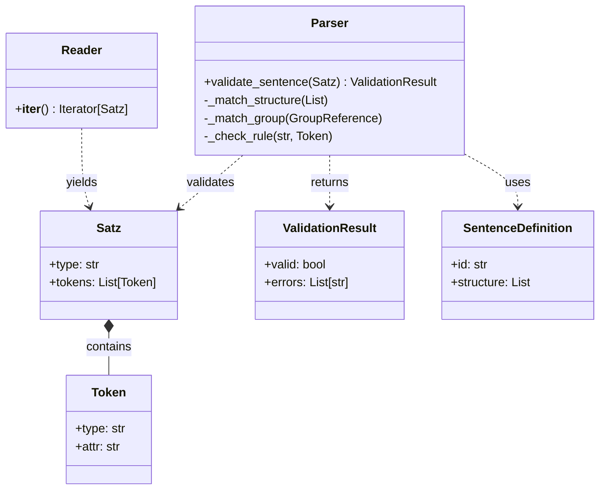
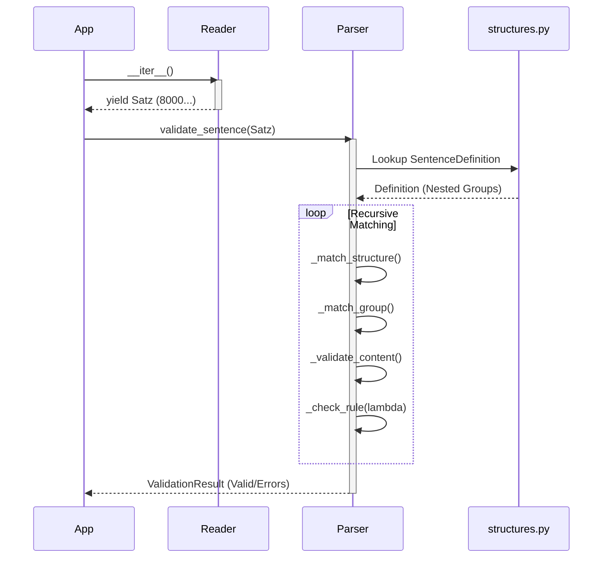

py_kvdt
=======


Python library for parsing and validating KVDT files (KBV Datentransfer).

## Features

- **Modern structure**: Clean package layout with type hints and dataclasses.
- **Full Standard Support**: Validates all KVDT field definitions and sentence structures (recursive).
- **Rule Engine**: Supports KVDT rule validation (including context-dependent checks).
- **Realistic Data Generator**: Generates valid KVDT test files with realistic German names, EBM 2025 GOPs, and ICD codes.
- **Pluggable Storage Sinks**: Export parsed data directly to **MongoDB** or **JSON** files.
- **High Test Coverage**: 95%+ code coverage with rigorous validation of generated data.
- **Modern Stack**: Built with Python 3.12, `uv` for dependencies, and Devbox for infrastructure.

## Installation

1. Clone the repository: `git clone https://github.com/maatini/py_kvdt.git`
2. Navigate to the directory: `cd py_kvdt`
3. Install (editable mode): `pip install -e .`

## Development with Devbox

This project uses [Devbox](https://www.jetpack.io/devbox/) to manage a consistent development environment.

### Prerequisites

- Install Devbox: `curl -fsSL https://get.jetpack.io/devbox | bash`

### Getting Started

1.  Enter the shell: `devbox shell`
2.  Initial setup (within shell): `devbox run setup`

### Available Scripts

You can run these scripts using `devbox run <script_name>`:

- `test`: Run unit tests (`python3 -m unittest discover tests`)
- `lint`: Run relaxed linting checks (`ruff check .`)
- `format`: Format code with 120 char limit (`black .`)
- `setup`: Install the package and dependencies (`uv pip install -e .`)
- `mongodb`: Start a local MongoDB instance in the background for storage tests.

## Usage

### CLI
Run the parser on a KVDT file:

# Basic validation
python3 -m pykvdt <path_to_file>

# Store as JSON
python3 -m pykvdt <path_to_file> --storage json --outdir ./output

# Store in MongoDB
python3 -m pykvdt <path_to_file> --storage mongo --uri "mongodb://localhost:27017/"

```python
from pykvdt.reader import Reader
from pykvdt.parser import Parser

# 1. Initialize Reader and Parser
reader = Reader("path/to/file.con")
parser = Parser()

# 2. Iterate over sentences
for satz in reader:
    # 3. Validate each sentence
    result = parser.validate_sentence(satz)
    
    if not result.valid:
        print(f"Validation failed for {satz.type}:")
        for error in result.errors:
            # Structured error information
            print(f"  - Line {error.line_nbr}: {error.message} (Field: {error.field_id})")
    else:
        print(f"Sentence {satz.type} is valid!")
```

### Detailed CLI Usage
The CLI provides a quick way to validate any KVDT file:

```bash
# Basic validation using the module
python3 -m pykvdt path/to/file.con

# Using the included script for bulk generation
PYTHONPATH=. python3 scripts/generate_test_data.py --count 5 --outdir ./output
```

### Advanced Error Handling
The library uses a structured exception and error reporting system. Instead of simple strings, you get `ValidationErrorObject` instances containing:

- **`message`**: Human-readable error description.
- **`field_id`**: The 4-digit KVDT field ID.
- **`line_nbr`**: The exact line number in the source file.
- **`satz_type`**: The sentence type context (e.g., '0101').

```python
from pykvdt.exceptions import KVDTReaderError

try:
    reader = Reader("corrupt_file.con")
    sentences = list(reader)
except KVDTReaderError as e:
    print(f"Critical file structure error at line {e.line_nbr}: {e}")
```

### Test Data Generation
Generate valid KVDT test packages with realistic data:

```bash
# Generate 10 files with 5-145 cases each
PYTHONPATH=src python3 scripts/generate_test_data.py --count 10 --outdir ./test_data --min-cases 5 --max-cases 145
```

The generator produces high-quality test data including:
- **BSNR/LANR**: Consistent and valid physician/facility identifiers.
- **Clinical Data**: Realistic EBM 2025 GOPs (e.g., `03000`, `01700`) and ICD-10 codes (e.g., `J06.9`, `I10`).
- **Patient Data**: Realistic German names, addresses, and eGK insurance numbers.

**Programmatic Generation:**
```python
from pykvdt.generator import Generator

gen = Generator()
# Generate a single valid 'ADT' sentence
satz = gen.generate_sentence("adt0")
print(satz.to_bytes().decode('iso-8859-15'))
```

## Testing & Coverage

Run all tests:
```bash
python3 -m unittest discover tests
```

Generate coverage report:
```bash
# Run tests with coverage
python3 -m coverage run -m unittest discover tests

# View summary
python3 -m coverage report

# Generate HTML report
python3 -m coverage html
```

Currently, the project maintains **>95% code coverage**.

### Storage Tests
The storage system is tested in `tests/test_storage.py`. By default, MongoDB tests are skipped unless a local instance is reachable.

## API Documentation
Interactive HTML documentation is available and can be generated using `pdoc`:

```bash
devbox run docs
# or
pdoc --output-dir docs src/pykvdt
```
The documentation includes detailed type information for all classes and methods.

## License
This project is licensed under the **MIT License** - see the [LICENSE](LICENSE) file for details.

## Legacy Code
The original 2014 implementation is available in the `legacy/` directory.


## Architecture & Approach

This project modernizes the parsing of KVDT files by strictly separating **Data** (Standard Definitions) from **Logic** (Parsing/Validation).

### 1. Table-Driven Parsing
The KVDT standard is inherently a collection of tables defining fields and sentence structures. Instead of hardcoding these rules into procedural code (e.g., `if field == '3000': ...`), this project defines them declaratively in `src/pykvdt/structures.py` and `src/pykvdt/definitions.py`.

**Advantages:**
- **Maintainability:** Updates to the standard (KBV updates) only require changes to the definition files, not the parser logic.
- **Readability:** The structure definitions map 1:1 to the official KBV specifications.
- **Decoupling:** The parser puts no constraints on the data structure, making it robust against changes.

### 2. Recursive Descent Parser
The `Parser` class (`src/pykvdt/parser.py`) implements a recursive descent algorithm that traverses the sentence definitions. It handles:
- **Nested Groups**: Supports arbitrary nesting of fields (e.g., `Leistungen` within `Satzart 0101`).
- **Repetition**: Handles fields and groups that can appear multiple times (`count` or `-1` for unlimited).
- **Rule Engine**: Evaluates context-dependent rules (e.g., "Field X is only allowed if Sentence is Y") using lambda expressions defined in the standard.

### 3. Type Safety & Modern Python
- **Dataclasses**: Used for all core models (`Token`, `Satz`, `ValidationResult`) to ensure data integrity.
- **Type Hints**: Fully typed codebase supporting modern IDEs and static analysis.
### 4. Validation Strategy
Validation occurs at three distinct levels to ensure data quality:
1.  **Field Level**: Checks format (Numeric, Alphanumeric, Date) and length constraints using regex and simple logic in `validators.py`.
2.  **Sentence Level**: The recursive parser validates the structure of a sentence (Order of fields, Missing mandatory fields/groups, Excess tokens).
3.  **Cross-Field Rules**: The `Parser` evaluates conditional rules (e.g., "Field A required if Field B is X") using the lambda expressions migrated from the standard.

### 5. Design Philosophy
- **Standard-First**: The code structure intentionally mirrors the KBV standard documents (tables). This makes it easy to verify the code against the official PDF specifications.
- **Decoupled Logic**: The parsing algorithm is generic and does not know about specific fields like "Patientennummer". This separation allows the library to support multiple KVDT versions or even other similar formats by simply swapping the definition files.
- **Modernity**: We leverage strict type hinting and dataclasses to catch errors early during development (Static Analysis) rather than at runtime.

### 6. Visual Architecture

**Class Relationships:**



**Parsing Flow:**




